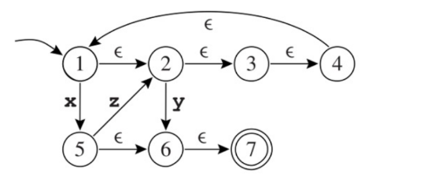

# Automata Determinisation

1. What is the language accepted by the automaton in the figure below?

{x, y ,z}

2. Show that it is not deterministic.

Автомат є недетермінованим, оскільки має переходи за порожнім символом, чого не може бути в детермінованих автоматах. Також існують стани, з яких можливі кілька переходів в інший стан (з 1 → 2 по епсілон, з 1 → 5 по x)

3. Determinise it.

 Побудуємо ε-замикаючу множину для кожного стану у недетермінованому автоматі:
  - 1 → {1, 2, 3, 4}
  - 2 → {2, 3, 4}
  - 3 → {3, 4}
  - 4 → {4}
  - 5 → {5, 6, 7}
  - 6 → {6, 7}
  - 7 → {7}

Тепер оцінимо можливі переходи:
{1, 2, 3, 4} → стан 5 по x, тобто в детермінованому автоматі бдемо мати:
{1, 2, 3, 4} → {5, 6, 7} по x

{1, 2, 3, 4} → стан 6 зі стану 2 множини, тобто будемо мати:
{1, 2, 3, 4} → {6, 7} по y
По z переходу не маємо

Тепер розглянемо множину станів {5, 6, 7}
{5, 6, 7} → стан 2 по z, тобто будемо мати:
{5, 6, 7} → {2, 3, 4} по z
Переходи по x, y - відсутні

Тепер розглянемо {2, 3, 4}
{2,34} → {6,7} по y
По x, z - переходи відсутні

Розглянемо {6, 7}
Переходи по x,y,z - відсутні
Оскільки 7 фінальний стан у недетермінованому автоматі, то {6,7} буде фінальним станом у детермінованому атоматі.

Тобто, стани, які будуть у детермінованому автоматі - {1, 2, 3, 4}; {2, 3, 4}; {5, 6, 7}; {6, 7}.
